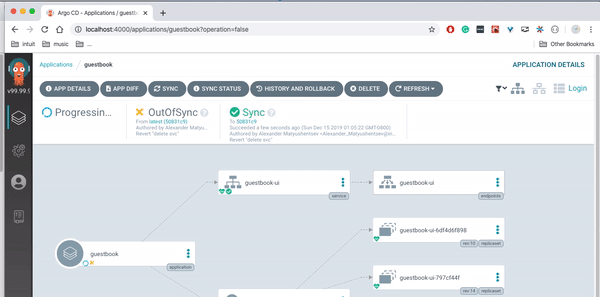

# Argo CD Notifier

Argo CD Notifier continuously monitors Argo CD applications and provides a flexible way to notify
users about important changes in the application state. The project includes a bundle of useful
built-in triggers and templates and aims to integrate with various notification services such as
☑ Slack, ☑ SMTP, Telegram, Discord, etc.



# Installation

```
kubectl apply -n argocd -f https://raw.githubusercontent.com/alexmt/argocd-notifications/v0.1.0/manifests/install.yaml
```

# Why use Argo CD Notifier?

The Argo CD Notifier is not the only way to monitor Argo CD application. You might leverage Prometheus
metrics and [Grafana Alerts](https://grafana.com/docs/grafana/latest/alerting/rules/) or projects
like [bitnami-labs/kubewatch](https://github.com/bitnami-labs/kubewatch) and
[argo-kube-notifier](https://github.com/argoproj-labs/argo-kube-notifier). The advantage of Argo CD Notifier is that
it is focused on Argo CD use cases and ultimately provides a better user experience. 

# Features

## Triggers and Templates

In order to use Argo CD Notifier, you need to configure a notification template and trigger that defines
the notification condition and references the notification template that defines notification content. 

The notification **trigger** definition includes name, condition and notification template reference:

* name - a unique trigger identifier.
* template reference - the name of the template that defines notification content.
* condition - a predicate expression that returns true if the notification should be sent. 

The following trigger sends a notification when application sync status changes to `Unknown`:

```
  - name: on-sync-status-unknown
    condition: app.status.sync.status == 'Unknown'
    template: app-sync-status
```

The trigger condition evaluation is powered by [antonmedv/expr](https://github.com/antonmedv/expr).
The condition language syntax is described at https://github.com/antonmedv/expr/blob/master/docs/Language-Definition.md.

The notification **template** is used to generate notification content. The template is leveraging
[html/template](https://golang.org/pkg/html/template/) golang package and allow to define notification title and body.
The template is meant to be reusable and can be referenced by multiple triggers.

The following template is used to notify the user about application sync status.

```
  - name: app-sync-status
    title: Application {{.app.metadata.name}} sync status is {{.app.status.sync.status}}
    body: |
      Application {{.app.metadata.name}} sync is {{.app.status.sync.status}}.
      Application details: {{.context.argocdUrl}}/applications/{{.app.metadata.name}}.
```

Both triggers and templates are defined in `argocd-notifications-cm` ConfigMap.

## Notifiers

The **notifiers** configuration holds notification services connection credentials. Currently only SMTP and Slack are supported.

SMTP configuration example:

```yaml
email:
  host: smtp.gmail.com
  port: 587
  from: <myemail>@gmail.com
  username: <myemail>@gmail.com
  password: <mypassword>
```

The list of notifiers is stored in `argocd-notifications-secret` Secret.

## Recipients

The list of recipients is not stored in a centralized configuration file. Instead, recipients might be configured using
`Application` or `AppProject` CRD annotations. The example below demonstrates how to subscribe to the email 
notifications triggered for a specific application:

```yaml
apiVersion: argoproj.io/v1alpha1
kind: Application
metadata:
  annotations:
    recipients.argocd-notifications.argoproj.io: email:<sample-email>
```

The example below demonstrates how to get to the Slack message on a notification of the any project application:

```yaml
apiVersion: argoproj.io/v1alpha1
kind: AppProject
metadata:
  annotations:
    recipients.argocd-notifications.argoproj.io: slack:<sample-channel-name>
```

# Roadmap/Project Stage

The project is in the early development stage. Currently, I'm looking for early adopters and feedback.
If the feedback and positive then project will be moved to https://github.com/argoproj-labs and we can work on the following features:

 * [ ] Subscribe to a particular trigger instead of all triggers.
 * [ ] More notification services (Telegram, Discord, Twilio)
 * [ ] State change notifications
 